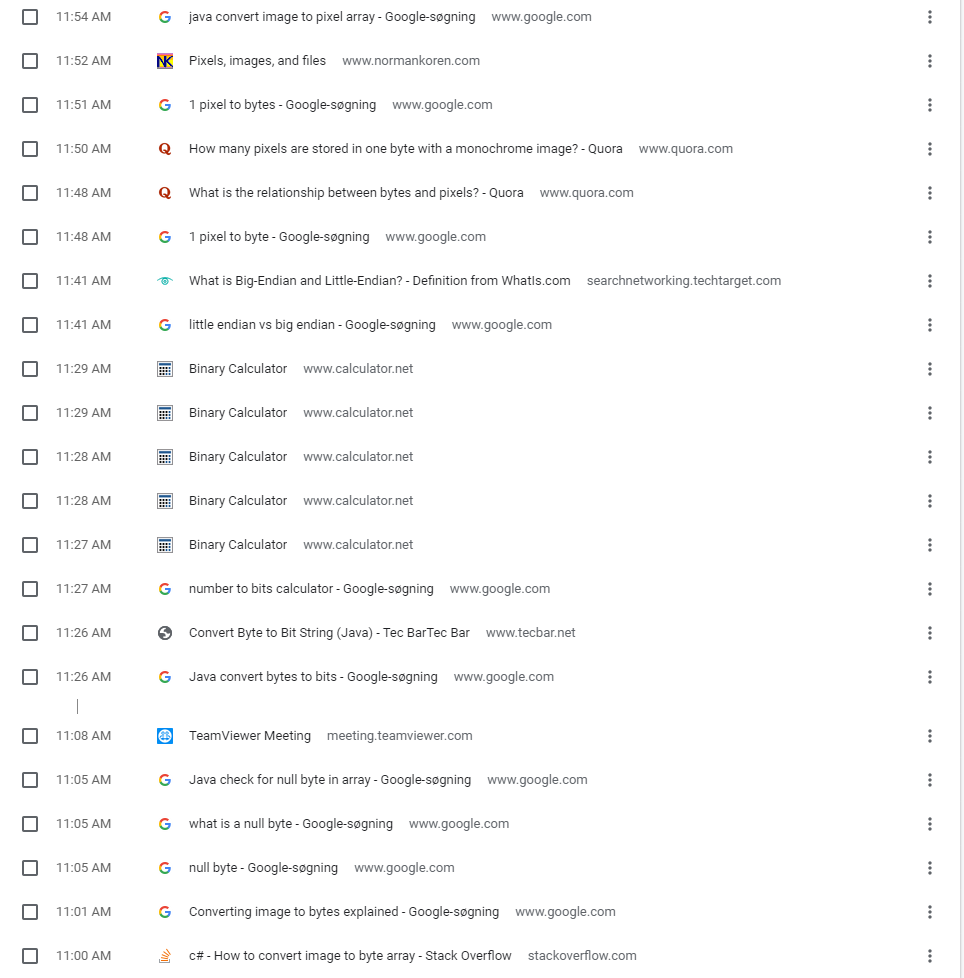

# UFOHiddenMessage

## Brainstorm
Brainstorm topics til at finde hemmelig besked i billede.

* Billed Converter (Billede -> string a bytes -> string af bits)
* Little endian
* Hvad er blue colors - Dette var et eksempel på hvordan det kunne gemmes
* ascii besked
* bits er gemt i pixel (0.0) og (1.0) osv.
* Vi skal kunne afgøre null-byte (er den også i little endian?)
* Pixel to bit conversion

Vi converterer billedefil til byte array -> Fail fast metode: Gå udfra at pixel 0.0 er det første i byte array’et. Led også efter null byte for at finde hvor beskeden slutter. Skær resten fra og convert bytes til bits. Læs beskeden.

## Logbog
* 11:00 - diskuterer opgavens omfang, brainstormer. 
* 11:30 - opgaven løseligt defineret, søger informationer om konvertering af billede til byte array.
* 12:00 - billede indlæses og konverteres til bytearray - vi har flere bytes end pixels. Der er tvivl om hvad der er encoded i little endian (besked eller billede). Vi har fundet ud af at vi er nødt til at hive de rigtige pixels ud før vi konverterer til bytes.
* 12:30 - Vi har fundet ud af at hente alle pixels ud der har 0 værdier på y aksen. (0.0) og (1.0) osv. men har fundet frem til at vi simpelthen ikke ved hvordan de specifikke bit værdier er gemt
* 13:00 -  pause til 14
* 14:00 - Vi fandt ud af at vi havde misforstået opgave beskrivelsen. Vi havde opfattet det som om vi kun skulle kigge på de pixels der lå på første x-column i billedet. og fik derfor nogle underlige resultater.
* 14:30 Vi har nu omskrevet koden til at kigge på alle pixels.
* 15:00 koden virker.

## Search history and visited sites
Simon:

Claus:

Mads: 

## 3 biggest stumbling blocks
Opgaveformuleringen - vi var i tvivl om hvilke bits der var encoded på pixels, opgaveformuleringen kunne godt have været mere klar.
Vi forstod opgavebeskrivelsen som 2 dele. Først en forklaring på hvordan stegonografi kan udføres, dernæst hvordan det var udført i dette tilfælde.

Konvertering - mellem pixels, bytes, bits, char[] osv. gav lidt knas. 
Det er altid lidt svært at bibeholde overblikket over de forskellige datastrukturer der arbejdes med i konverteringen mellem pixels, karakterer, tekststrenge, chars mv.
Især ift. allokering af plads kan give udfordringer, når man arbejder med arrays der ikke er fleksible.
Herudover var vi nødt til at læse lidt op på ascii karakterer for at forstå hvordan den resulterende, binære streng fra billedets pixels, skulle opdeles.

Forståelse af billedhåndtering - argb samt repræsentation af de forskellige værdier binært.
